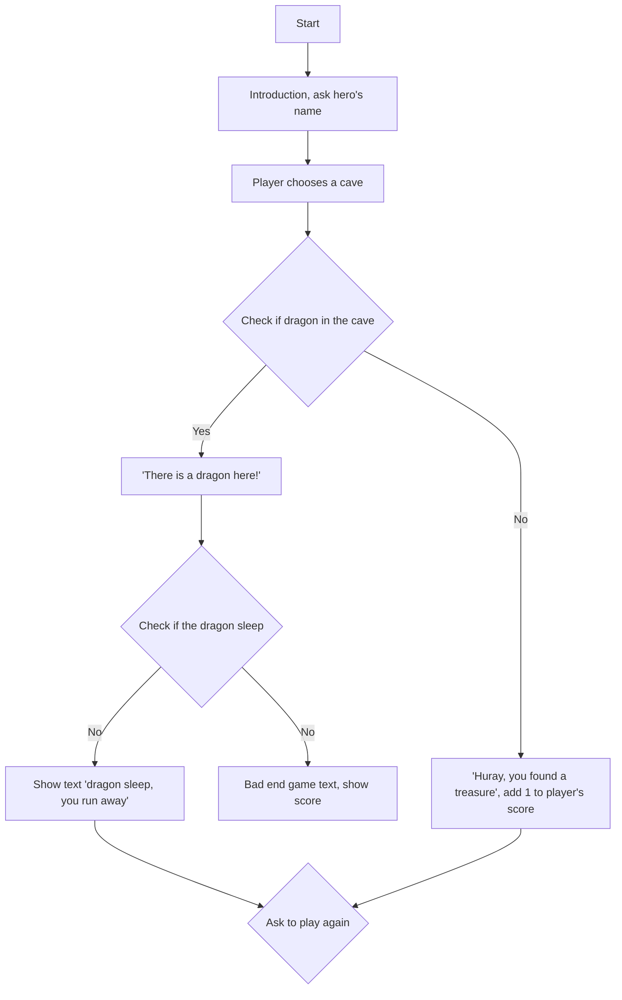

# Fantasy_Realm
## the game about caves, dragons and caves

```mermaid
flowchart TD

A[Start] --> B[Introduction, ask hero's name];
B --> C[Player chooses a cave];
C --> D{Check if dragon in the cave};
D -- No --> X['Huray, you found a treasure', add 1 to player's score]
D -- Yes --> E['There is a dragon here!']
E --> F{Check if the dragon sleep}
F -- No --> G[Bad end game text, show score]
F -- No --> H[Show text 'dragon sleep, you run away']
H --> Y{Ask to play again}
X --> Y{Ask to play again}

```